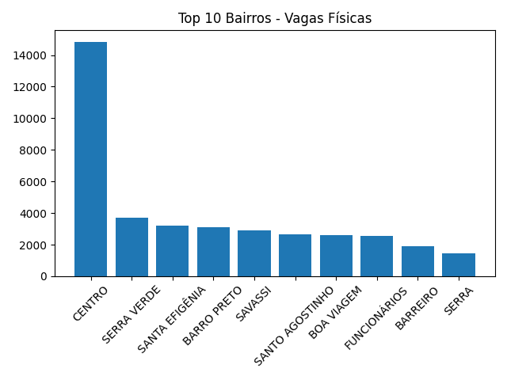
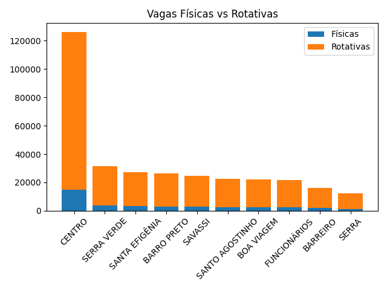
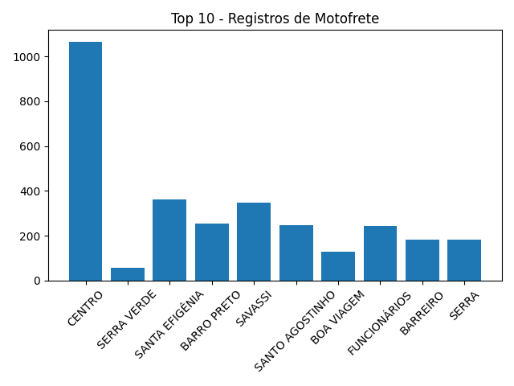
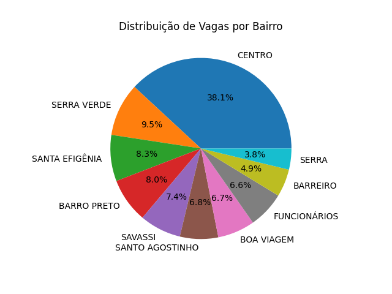
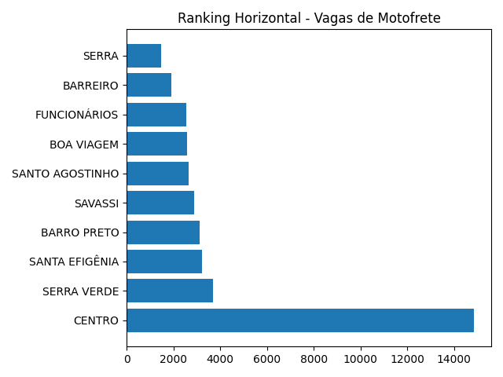
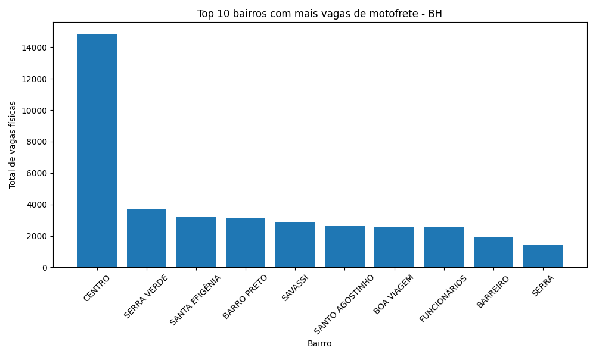

## 📊 Visualizações dos Dados

### 1️⃣ Ranking de Vagas Físicas

### 2️⃣ Comparação de Tipos de Vagas

### 3️⃣ Total de Registros

### 4️⃣ Distribuição Percentual

### 5️⃣ Ranking Horizontal

### 6️⃣ Top 10 Bairros

✅ Isso já vai funcionar direto no GitHub.

✅ Agora — explicação PROFISSIONAL de cada gráfico

(essa parte é o que valoriza seu projeto no LinkedIn e recrutadores 👇)

Você pode colocar exatamente assim no README:

📊 Análise Visual dos Dados

Este projeto gera automaticamente gráficos analíticos a partir dos dados públicos de estacionamento, permitindo identificar padrões urbanos e oportunidades de análise para mobilidade e logística urbana.

🥇 01 — Ranking de Vagas Físicas

Objetivo:
Apresentar quais categorias ou regiões possuem maior quantidade total de vagas físicas disponíveis.

Insights possíveis:

Identificação de regiões com maior infraestrutura urbana
Apoio a decisões logísticas
Base para estudos de mobilidade urbana
⚖️ 02 — Comparação de Vagas

Objetivo:
Comparar diferentes tipos de vagas existentes no dataset.

O que demonstra:

Diferença entre vagas físicas e rotativas
Distribuição operacional do estacionamento
Eficiência do uso do espaço público
📈 03 — Total de Registros

Objetivo:
Mostrar o volume total de registros analisados.

Importância:

Demonstra escala do dataset
Valida robustez da análise
Evidencia capacidade de processamento do pipeline ETL
🧩 04 — Distribuição Percentual

Objetivo:
Visualizar a proporção entre categorias de dados.

Benefícios:

Entendimento rápido da composição dos dados
Identificação de dominância de categorias
Base para análises comparativas futuras
📊 05 — Ranking Horizontal

Objetivo:
Apresentar ranking em formato horizontal para melhor leitura comparativa.

Por que usar:

Melhor visualização quando existem muitos itens
Facilita leitura em apresentações e dashboards
Mais acessível visualmente
🏙️ 06 — Top 10 Bairros com Mais Vagas

Objetivo:
Identificar os bairros com maior concentração de vagas públicas.

Insights estratégicos:

Regiões com maior fluxo urbano
Possíveis áreas ideais para motofrete/logística
Apoio à análise de mobilidade urbana em Belo Horizonte
✅ Dica MUITO importante (GitHub)

Depois de editar:

CTRL + S
git add .
git commit -m "fix: imagens README"
git push
